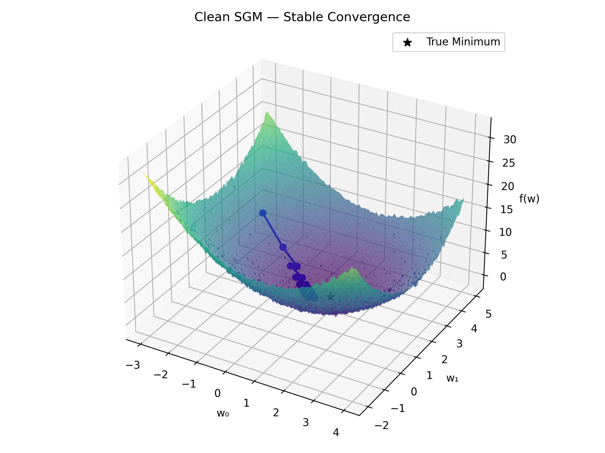
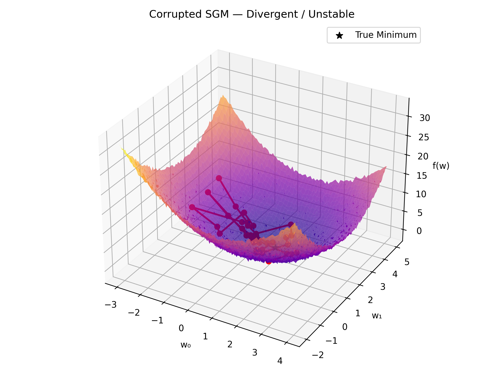
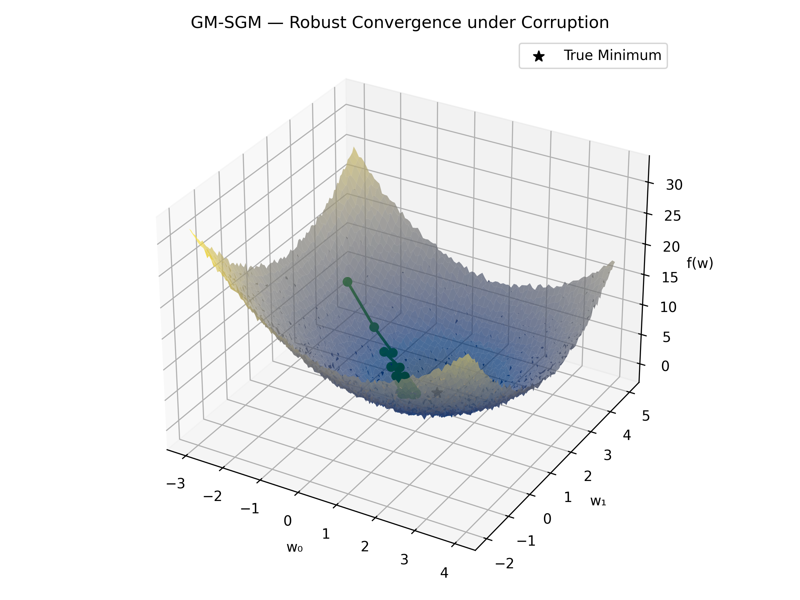
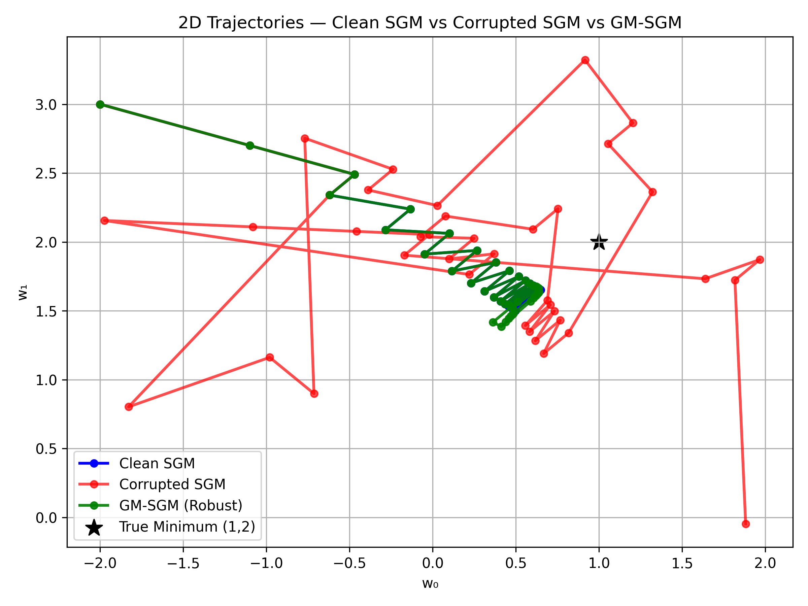

# Robustness of SGM vs GM-SGM under Gradient Corruption

This experiment compares **Switching Gradient Method (SGM)** and its **Geometric Median variant (GM‑SGM)** under the presence of corrupted gradients. The objective is to visualize and understand **why standard SGM diverges** in noisy environments, while **GM‑SGM remains stable**.

---

##  Background

We use a simple convex quadratic objective:

f(w_0, w_1) = (w_0 - 1)^2 + (w_1 - 2)^2

Its gradient is:

nabla f(w) = 2(w - [1, 2])

Additionally, there’s a linear constraint:

g(w) = w_0 + w_1 - 2 \\leq 0

---

##  Methods Compared

### **1. Standard SGM**
SGM performs iterative updates based on the gradient of \\( f \\) (or \\( g \\) when the constraint is violated):

w_{t+1} = w_t - \\eta \\nabla f(w_t)

However, when **gradients are corrupted** (simulating adversarial noise or outlier data), we randomly inject Gaussian noise into 40% of gradient computations:

\\[
\\nabla f'(w) = \\nabla f(w) + 3\\varepsilon, \\quad \\varepsilon \\sim \\mathcal{N}(0, 2^2)
\\]

This results in unstable, oscillatory updates.

### **2. GM‑SGM (Geometric Median SGM)**
Instead of averaging the gradients, GM‑SGM computes the **geometric median** across a small batch of gradient samples

This aggregation is **robust to outliers**: as long as fewer than 50% of gradients are corrupted, the median stays close to the true descent direction.

---

##  Observations

### 🟦 Clean SGM (No Corruption)
Smooth convergence to the global minimum at **(1, 2)**.

---

### 🟥 Corrupted SGM (40% Noisy Gradients)
Diverges due to the dominance of large, random gradients that distort the descent direction.

---

### 🟩 GM‑SGM (40% Noisy Gradients)
Remains **stable and convergent** despite identical corruption. The geometric median filters out extreme outliers and preserves descent consistency.

---

##  2D Comparison

Visual comparison of all three trajectories:

---

##  Mathematical Insight

| Method | Aggregation | Sensitivity to Outliers | Convergence Behavior |
|---------|--------------|--------------------------|-----------------------|
| **SGM (Clean)** | Mean | Low |  Stable |
| **SGM (Noisy)** | Mean | High | ❌ Diverges |
| **GM‑SGM (Noisy)** | Geometric Median | Robust (≤50%) |  Stable |

The **geometric median** has a **breakdown point of 0.5**, meaning that it remains reliable as long as fewer than half of the gradients are corrupted — exactly the case here (40%).

---

##  Intuition

Think of the gradients as “votes” for a direction.  
- In SGM, a few corrupted votes can shift the average drastically.  
- In GM‑SGM, those extreme votes are ignored since the **median** stays near the center of consensus.

Thus, GM‑SGM succeeds under identical corruption where SGM fails.

---

##  Files Generated

| File | Description |
|------|--------------|
| `sgm_clean_3d.png` | Clean convergence |
| `sgm_corrupted_3d.png` | Divergent trajectory under corruption |
| `gm_sgm_corrupted_3d.png` | Robust convergence under corruption |
| `sgm_gmsgm_2d_comparison.png` | 2D comparison of all methods |

---

## Conclusion

Under identical 40% gradient corruption, **SGM diverges** while **GM‑SGM converges** because the **geometric median aggregation** effectively ignores corrupted gradients. This demonstrates the **robustness of median-based updates** in noisy or adversarial training environments.
"""