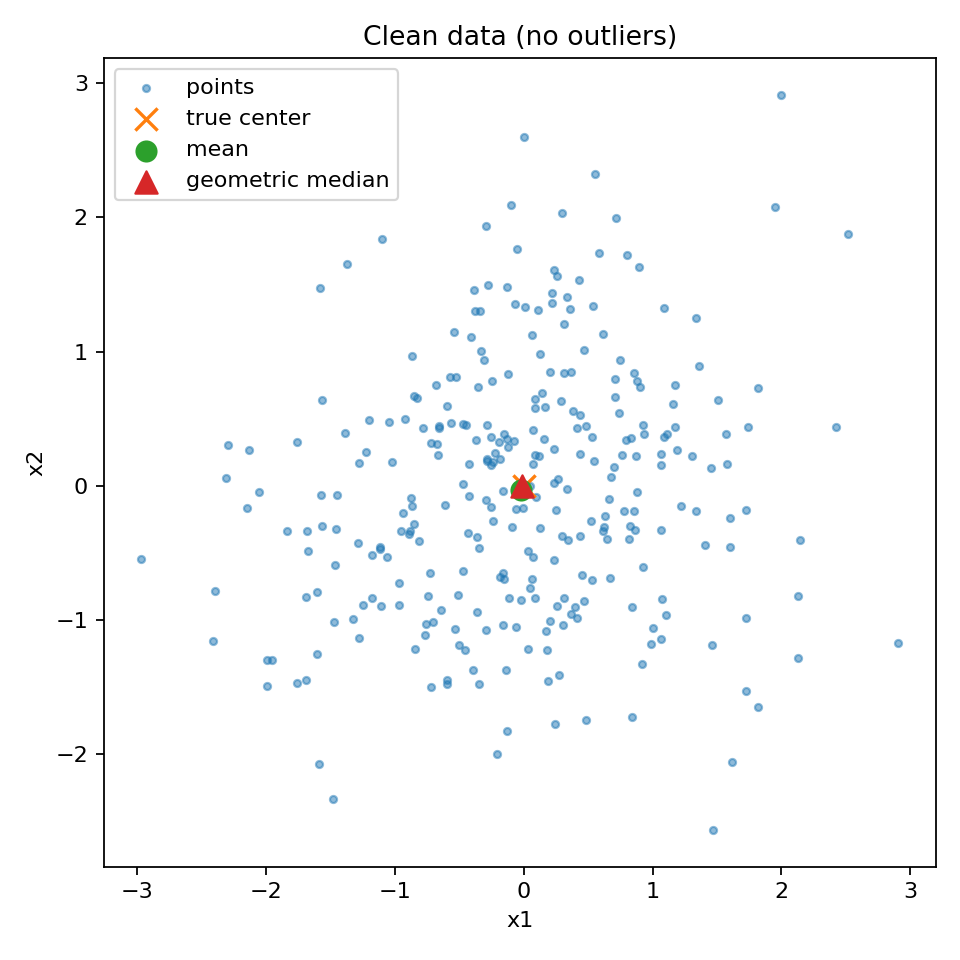

# Geometric Median Robustness Demonstration (GM Demo)

This small experiment demonstrates the **robustness of the Geometric Median (GM)** as an aggregation operator — showing that, unlike the mean, it remains stable even when **30% of the data points are corrupted or adversarial outliers**.

---

## Background and Motivation

In standard optimization or statistics, the **mean** is commonly used as a measure of central tendency.  
However, the mean is **extremely sensitive to outliers**: even a single corrupted point placed far away can drag the average arbitrarily far from the true center.

To address this, the **Geometric Median (GM)** — also known as the **spatial median** — provides a *robust* alternative.  
For a set of points \( X = \{x_1, \dots, x_n\} \subset \mathbb{R}^d \), the GM is defined as  
\( \mathrm{GM}(X) = \arg\min_{y \in \mathbb{R}^d} \sum_{i=1}^{n} \| x_i - y \| \).

Unlike the mean (which minimizes squared distance), the GM minimizes the **sum of Euclidean distances**, which greatly reduces the influence of large deviations.

---

##  Theoretical Foundation

### Breakdown Point

The robustness of an estimator is often quantified by its **breakdown point** —  
the largest fraction of arbitrarily corrupted samples that the estimator can tolerate before giving arbitrarily wrong results.

- For the **mean**, the breakdown point is **0%** — a single extreme outlier can destroy it.  
- For the **geometric median**, the breakdown point is **½**, meaning:
  
  > The geometric median remains accurate even if up to 50% of the samples are arbitrarily corrupted.

This property was first formalized by Huber (1981) and later refined in robust statistics and optimization theory.  
It’s a cornerstone result used in modern *Byzantine-resilient distributed optimization* and *robust machine learning*.

---

##  Experiment Setup

We simulate a simple 2D example with two scenarios:

1. **Clean Data:**  
   300 points sampled from a Gaussian centered at (0, 0).

2. **Corrupted Data (30% Outliers):**  
   300 inliers + 130 outliers located far away at (25, 25).

For each scenario, we compute:
- the **sample mean**
- the **geometric median** (using the Weiszfeld algorithm)

We then compare their distances to the true center (0, 0).

---

##  Results Summary

| Scenario | Mean Error | GM Error | Notes |
|-----------|-------------|----------|-------|
| Clean Data | ~0.04 | ~0.02 | Both accurate |
| Corrupted (30% Outliers) | **~10.7** | **~0.7** | GM remains near the true center; mean collapses |

Two plots (`clean.png`, `corrupted.png`) visualize how the GM stays centered even when the data is heavily corrupted.

---

##  Interpretation and Implications

This demo empirically verifies the theoretical claim that **the Geometric Median is robust to adversarial corruption**.

In later work, this property will be leveraged as a **robust gradient aggregation mechanism** for optimization algorithms — particularly:

- In the **Geometric Median Switching Gradient Method (GM-SGM)**, we will use GM to aggregate stochastic gradients within the switching framework of SGM.  
- This combination aims to make first-order constrained optimization resilient to noisy or malicious gradients while maintaining convergence guarantees.

The present experiment serves as a **sanity check** and **visual proof** of robustness before integrating GM into high-dimensional, gradient-based methods.

---

## Files

| File | Description |
|------|--------------|
| `gm_vs_mean.py` | Main script generating data, computing GM and mean, and producing figures |
| `clean.png` | Visualization of clean scenario (both estimators close) |
| `corrupted.png` | Visualization of outlier scenario (mean fails, GM holds) |
| `summary.csv` | Numeric results summary (errors, coordinates) |

---

### Visualizations

<p align="center">
  
  
</p>


##  Run Locally

```bash
# Setup
brew install python
python3 -m venv .venv
source .venv/bin/activate
pip install numpy matplotlib pandas

# Run
python gm_vs_mean.py
